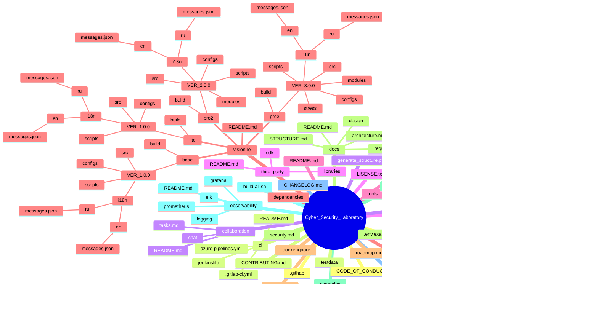

# 📂 Структура проекта

## Дерево проекта
```
Cyber_Security/
├── .githab
├── ci
│   ├── .gitlab-ci.yml
│   ├── azure-pipelines.yml
│   ├── jenkinsfile
│   └── README.md
├── collaboration
│   ├── chat
│   ├── README.md
│   └── tasks.md
├── common
│   ├── build
│   ├── compliance
│   ├── docs
│   ├── i18n
│   │   ├── en
│   │   │   └── messages.json
│   │   └── ru
│   │       └── messages.json
│   ├── include
│   ├── logging
│   ├── src
│   ├── tests
│   │   ├── e2e
│   │   ├── integration
│   │   ├── mocks
│   │   └── unit
│   └── README.md
├── compliance
│   ├── FSB
│   ├── FSTEC
│   ├── GOST
│   ├── MVD
│   └── README.md
├── dependencies
├── deployment
│   ├── ansible
│   ├── docker
│   ├── k8s
│   ├── kubernetes
│   ├── terraform
│   └── README.md
├── docs
│   ├── design
│   ├── architecture.md
│   ├── README.md
│   ├── requirements.md
│   └── STRUCTURE.md
├── exemples
│   ├── demos
│   └── quickstart
├── observability
│   ├── elk
│   ├── grafana
│   ├── logging
│   ├── prometheus
│   └── README.md
├── secrets
│   ├── policies
│   ├── templates
│   └── README.md
├── security
│   ├── policies
│   ├── scans
│   ├── tests
│   └── README.md
├── testdata
├── tests
│   ├── e2e
│   ├── integration
│   └── unit
├── third_party
│   ├── libraries
│   ├── sdk
│   └── README.md
├── tools
│   └── README.md
├── vision-le
│   ├── base
│   │   ├── build
│   │   └── VER_1.0.0
│   │       ├── configs
│   │       ├── i18n
│   │       │   ├── en
│   │       │   │   └── messages.json
│   │       │   └── ru
│   │       │       └── messages.json
│   │       ├── scripts
│   │       └── src
│   ├── lite
│   │   ├── build
│   │   └── VER_1.0.0
│   │       ├── configs
│   │       ├── i18n
│   │       │   ├── en
│   │       │   │   └── messages.json
│   │       │   └── ru
│   │       │       └── messages.json
│   │       ├── scripts
│   │       └── src
│   ├── pro2
│   │   ├── build
│   │   └── VER_2.0.0
│   │       ├── configs
│   │       ├── i18n
│   │       │   ├── en
│   │       │   │   └── messages.json
│   │       │   └── ru
│   │       │       └── messages.json
│   │       ├── modules
│   │       ├── scripts
│   │       └── src
│   ├── pro3
│   │   ├── build
│   │   └── VER_3.0.0
│   │       ├── configs
│   │       ├── i18n
│   │       │   ├── en
│   │       │   │   └── messages.json
│   │       │   └── ru
│   │       │       └── messages.json
│   │       ├── modules
│   │       ├── scripts
│   │       ├── src
│   │       └── stress
│   └── README.md
├── .dockerignore
├── .env.example
├── .gitignore
├── build-all.sh
├── CHANGELOG.md
├── CODE_OF_CONDUCT.md
├── CONTRIBUTING.md
├── generate_structure.py
├── LISENSE.txt
├── README.md
├── requirements.txt
├── roadmap.md
└── security.md
```

## Mindmap (Mermaid)


## 📖 Описание директорий

| Директория | Назначение |
|------------|------------|
| `compliance/` | Внешние стандарты и регуляторные требования (ФСТЭК, ФСБ, МВД, ГОСТ). |
| `deployment/` | Инфраструктурный код и автоматизация (Terraform, Ansible, Docker, K8s). |
| `observability/` | Мониторинг и наблюдаемость (Prometheus, Grafana, ELK). |
| `secrets/` | Управление секретами: шаблоны и политики доступа. |
| `third_party/` | Сторонние зависимости: SDK и библиотеки. |
| `security/` | Политики ИБ, сканы, тестирование безопасности. |
| `examples/` | Примеры и демонстрации: quickstart и демо. |
| `common/` | Общие компоненты проекта (код, тесты, логирование, документация). |
| `vision-le/` | Разные редакции продукта (Lite, Base, Pro², Pro³). |
| `collaboration/` | Средства для совместной работы (чат). |
| `tools/` | Вспомогательные скрипты и утилиты. |
| `ci/` | Конфигурации CI/CD (GitLab, Jenkins, Azure). |
| `docs/` | Общая документация: архитектура, гайды. |
